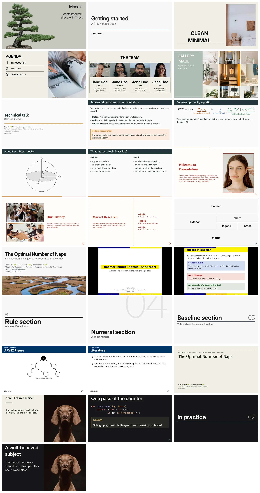

<p align="center">
  <a href="https://vincentarelbundock.github.io/mosaic"></a>
</p>

<h1 align="center">Mosaic</h1>

<p align="center"><em>Beautiful slides for <a href="https://typst.app/">Typst</a>.</em></p>

Write your talk as an ordinary Typst document and Mosaic makes the slides for you. Style them with the `set` and `show` rules you already know, because Mosaic is a thin layer on Typst rather than a framework: it adds slides, named cells, and sensible defaults, then leaves the rest of the document to the language itself. Batteries included: modern themes, ready-made layouts, nested grids, incremental reveals, speaker notes, handouts, callouts, cards, quotes, and progress indicators.

## Website


Detailed documentation, many examples, and themes can be found on the package website:

<https://vincentarelbundock.github.io/mosaic>

## Install

Mosaic requires Typst 0.15 or newer. The released version is 0.0.1, published on Typst Universe, so importing it needs no installation step:

```typ
#import "@preview/mosaic:0.0.1" as m
```

This repository is the development version, 0.0.2. It carries features the released package does not have, and the documentation marks each of them where it describes them. One command installs a snapshot of it, on macOS, Linux, or a Unix shell on Windows (Git Bash, WSL):

```sh
curl -fsSL https://raw.githubusercontent.com/vincentarelbundock/mosaic/main/install.sh | sh
```

Decks then import `@local/mosaic:0.0.2`. Note that the snapshot tracks `main`, so running the command again after a version bump installs the new version alongside the old. Passing `--ref` (`| sh -s -- --ref <tag-or-commit>`) pins a specific revision, and `--uninstall` removes what the script installed, after which only the published 0.0.1 resolves.

The same script serves development: clone the repository and run `make install` (or `sh install.sh`), which copies the working tree instead of fetching a snapshot; this is how the tests resolve the package. `make uninstall` removes it.

## A complete deck

```typ
#import "@local/mosaic:0.0.2" as m

#show: m.setup.with(title: [A short talk])

#m.slide(layout: "title")

= Methods

== Data

One slide.

== Model

Another slide.
```

Compile it with `typst compile talk.typ`. A level-one heading opens a section slide, a level-two heading a content slide, and everything between them is ordinary Typst content.

## Gallery

Here are some slides created with Mosaic:


