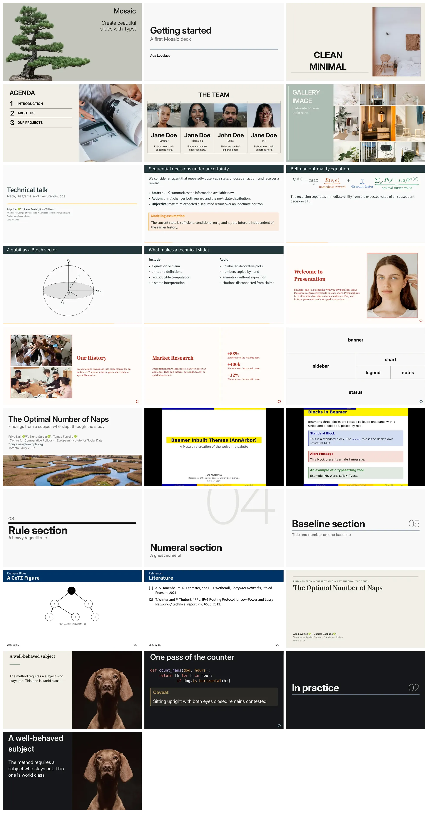

Write your talk as an ordinary Typst document and Mosaic makes the slides for you. Style them with the `set` and `show` rules you already know, because Mosaic is a thin layer on Typst rather than a framework: it adds slides, named cells, and sensible defaults, then leaves the rest of the document to the language itself. Batteries included: five themes, ready-made layouts, nested grids, incremental reveals, speaker notes, handouts, callouts, cards, quotes, and progress indicators.



Full documentation, a gallery of complete decks, and a tour of the themes live on the package website: <https://vincentarelbundock.github.io/mosaic>

## A complete deck

```typ
#import "@preview/mosaic:0.0.1" as m

#show: m.setup.with(title: [A short talk])

#m.slide(layout: "title")

= Methods

== Data

One slide.

== Model

Another slide.
```

Compile it with `typst compile talk.typ`. A level-one heading opens a section slide, a level-two heading a content slide, and everything between them is ordinary Typst content. Nothing else is required: `m.setup` is the only show rule a deck needs.

## Configure the deck once

Deck identity, semantic colors, recurring cell content, and the full-slide planes are all declared in `setup`:

```typ
#import "@preview/mosaic:0.0.1" as m

#show: m.setup.with(
  title: [Reliable systems],
  subtitle: [One source of truth],
  authors: ([Ada Lovelace], [Grace Hopper]),
  date: [2026],
  colors: (accent: rgb("#007f73")),
  paper: "16-9",
  cells: (footer: [Mosaic]),
  foreground: place(bottom + right, m.components.progress()),
)

#m.slide(layout: "title")
```

Other setup options include `layouts:` (replace the title, section, or content layout deck-wide), `spacing:`, `handout: true` (keep only the final frame of each slide), `output: "speaker"` or `"notes"`, and `overflow: "error"` (fail the compile when any cell overflows).

## Layouts

`layout:` selects a ready-made slide arrangement, and any further named argument is a field of that layout:

```typ
#m.slide(layout: "title", variant: "kicker")
#m.slide(layout: "section", variant: "numeral")[Methods]
#m.slide(layout: "content", columns: 2)[== Comparison][Left column][Right column]
#m.slide(layout: "image", image: path("gdp.png"), caption: [Growth since 1950])[== Results]
```

The selectable layouts are `content`, `title`, `section`, and `image`, each with several variants: title pages that are ruled, centered, bordered, magazine-style, or built around a photograph; section dividers with giant numerals, hairlines, or a live table of contents; image slides that contain, crop, or full-bleed the picture.

## Themes

Each theme is a complete facade exposing the identical API, so switching one is a one-line change:

```typ
#import "@preview/mosaic:0.0.1" as mosaic
#import mosaic.themes.metropolis as m

#show: m.setup
```

The bundled themes are `default`, `editorial` (magazine serif), `metropolis` (a Beamer homage), `manifesto` (red poster), and `mono` (terminal). There is no separate dark theme: polarity is a palette, and every theme adapts to it, syntax highlighting included.

```typ
#show: m.setup.with(colors: m.palettes.dark)
```

`palettes` also carries six complete schemes (`parchment`, `sage`, `stone`, `espresso`, `forest`, `slate`), and `colors:` accepts partial overrides of the eight semantic entries. A single slide inverts with `#m.slide(invert: true)`. Whole themes can be written from scratch, or derived from a bundled one, through `m.themes.setup`.

## Grids of named cells

When no stock layout fits, describe the slide as a tree of named cells:

```typ
#let composition = m.grids.columns(
  m.grids.track(2fr, "main"),
  m.grids.track(1fr, m.grids.rows(
    m.grids.track(2fr, "notes"),
    m.grids.track(1fr, "source"),
  )),
)

#m.slide(
  layout: composition,
  cells: (
    main: [The main argument],
    notes: [Two parts notes],
    source: [One part source],
  ),
)
```

Every cell is a native Typst layer carrying a `<mosaic-cell-ID>` label, so styling is an ordinary show rule rather than a framework option:

```typ
#show label("mosaic-cell-source"): set text(size: 0.7em, style: "italic")
```

## Incremental reveals

```typ
== Findings

- Always visible

#m.steps.pause

- Arrives on the second frame

#m.steps.reveal[
  - One
  - Two
  - Three
]

#m.steps.on("2-")[Visible from step two onward]

#m.steps.replace[First version][Second version]
```

`m.steps.drawing` connects the same timing model to CeTZ canvases and Fletcher diagrams. `setup(handout: true)` collapses every reveal to its final frame.

## Components and speaker notes

`m.components` provides `card`, `callout`, `badge`, `quote`, `divider`, `progress`, `figure`, and `image`. Each takes a semantic `role:` (`accent`, `warning`, `error`, `neutral`) that draws its colors from the active theme, plus flat overrides for one-off cases.

```typ
#m.components.callout(role: "warning", title: [Caveat])[Standard errors are clustered.]
```

Speaker notes attach to any slide with `m.note[...]` and never appear in the default output. Compile the same source with `output: "speaker"` for a presenter view, or `output: "notes"` for printable notes.

## Documentation

The website has a tutorial, a full API reference, a gallery of complete decks, and pages on themes, layouts, grids, incremental reveals, and typography: <https://vincentarelbundock.github.io/mosaic>

## License

Mosaic is released under the MIT License; see [LICENSE](LICENSE).

Two parts of the package carry additional terms, recorded in [THIRD_PARTY_LICENSES.md](THIRD_PARTY_LICENSES.md):

- `src/themes/metropolis/` and `src/themes/metropolis.typ` adapt the visual design of the [Metropolis](https://github.com/matze/mtheme) Beamer theme by Matthias Vogelgesang, and are offered under the same CC BY-SA 4.0 license as the original.
- `src/fit.typ` and parts of `src/deck-state.typ` are adapted from [Touying](https://github.com/touying-typ/touying), used under the MIT License.
